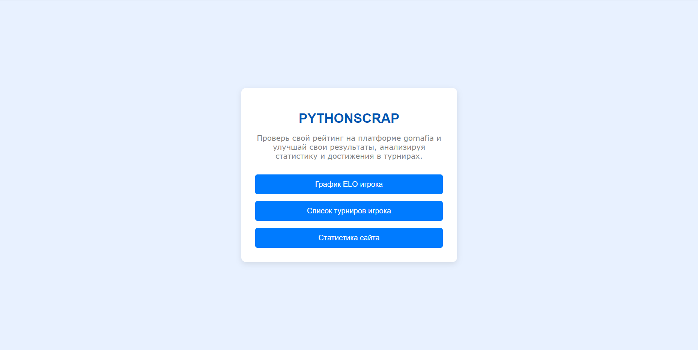
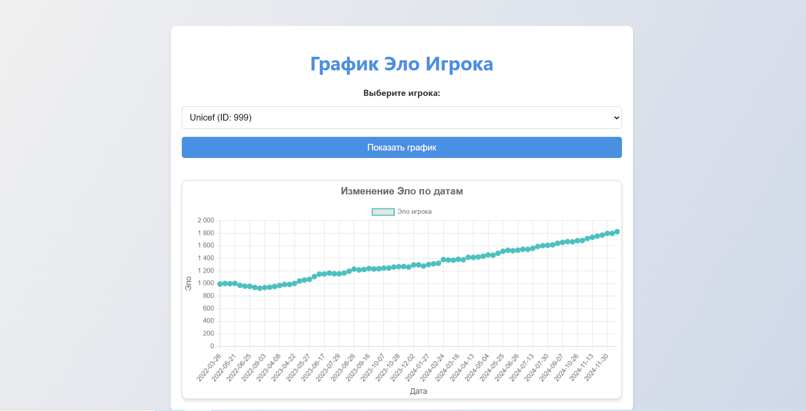
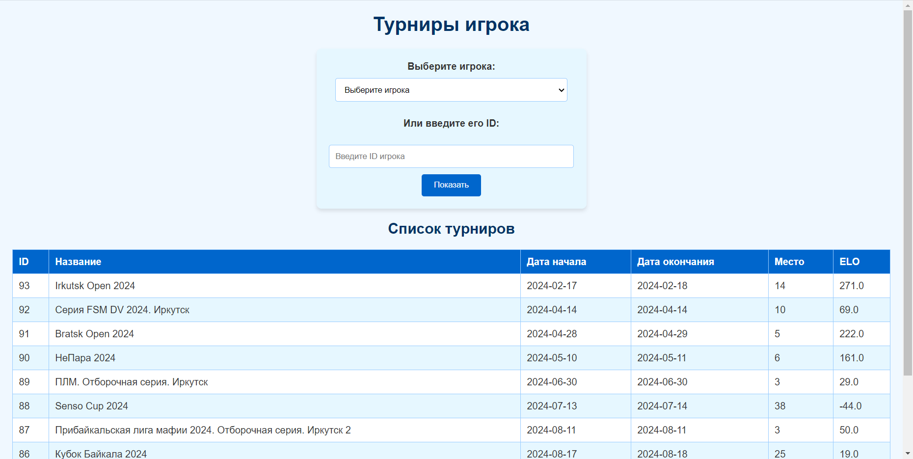
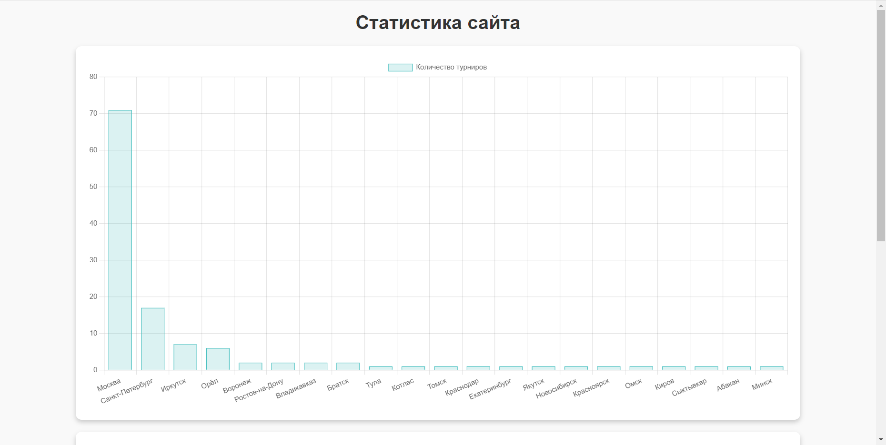
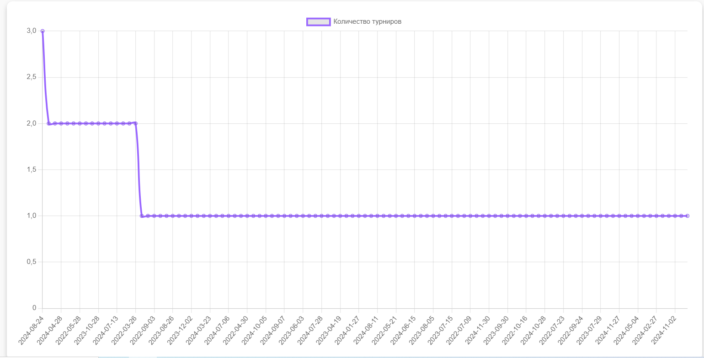

## Описание

Этот проект был выполнен в рамках курса по IT-технологиям для второго курса ИРНИТУ. Проект представляет собой сервис, который скрапит сайт **gomafia.pro**, собирая необходимую информацию и сохраняет ее в базе данных PostgreSQL, которая запускается в отдельном Docker-контейнере. Проект использует Docker Compose для упрощения процесса развертывания и запуска.

## Структура проекта

- **docker-compose.yml** — конфигурация для поднятия контейнеров для приложения и базы данных.
- **build.sh** — скрипт для сборки и запуска проекта. Включает в себя все необходимые шаги: подъем сервисов, проведение миграций и т.д.
- **pythonscrap/** — исходный код проекта, включая логику для скрапинга и работы с базой данных.
- **README.md** — этот файл, в котором указаны инструкции по использованию проекта.
## Технологии

- Python 3.x
- Django
- PostgreSQL
- Docker & Docker Compose
## Как запустить проект
1. Клонируйте репозиторий
2. Убедитесь, что у вас установлен Docker и Docker Compose.
3. Запустите проект с помощью скрипта `build.sh`:
```
./build.sh
```
4. После этого проект будет доступен по адресу http://localhost:8000.
## Также проект запущен на сервере и открыт для подключений:
[Подключиться](http://45.12.254.67:8000/)

Ссылка для копирования:
```
http://45.12.254.67:8000/
```

## Структура базы данных

Проект использует базу данных PostgreSQL, которая запускается в отдельном контейнере. При первом запуске проекта все необходимые миграции будут автоматически выполнены через скрипт `build.sh`
## Как пользоваться сервисом
Основная страница:

График ELO игрока:
В спортивной мафии, за турниры под эгидой ФСМ у каждого участника турниров есть его значение ELO. Оно меняется в зависимости от места, которое участник занял на турнире.
Сервис позволяет посмотреть, как росло ELO игрока по его ID на сайте gomafia. Также, есть скролл игроков по их никам, согласно тому, что сейчас записано в базу данных.

График интерактивный: можно посмотреть дату и точное значение эло на этот момент.
Турниры игрока:

Можно посмотреть список, либо обновить базу данных, добавив в нее какого-либо игрока.
На странице статистики сайта можно посмотреть, в каких городах проводилось больше всего турниров, и на какую дату выпало большее количество турниров.


Все графики также интерактивны и обновляются в зависимости от добавленных данных.
Для качественной проверки работы сервиса, можете добавить в базу данных следующих игроков:
- Ferrari, ID: 575
- Unicef, ID: 999
- Кьюренс, ID: 7113 (Автор проекта)
- РФ, ID: 1115
- Логан, ID: 6146
Либо убрать комментарий в части кода manage.py:
```
if __name__ == '__main__':  
    # database = DatabaseManager()  
    # for i in range(3000, 3500):    
    # database.add_player_from_id(i)
    main()
```
## Лицензия

Этот проект распространяется под лицензией MIT.